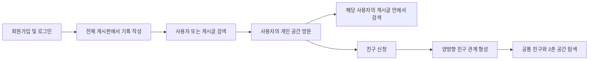
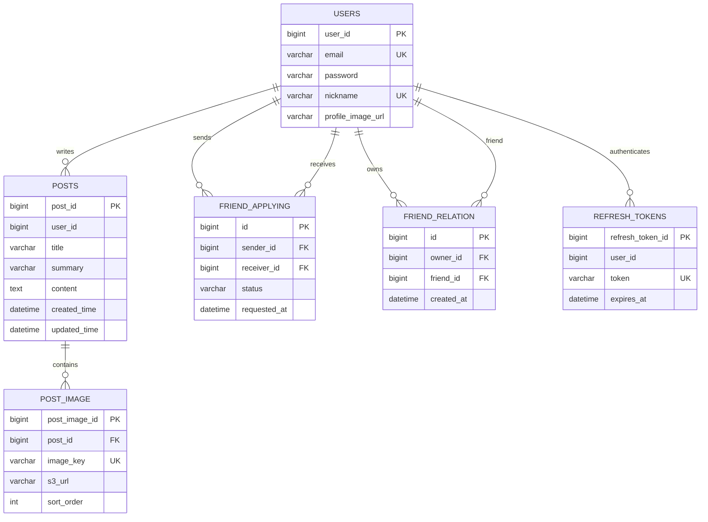

# 🏠 개인 공간과 관계를 중심으로 한 커뮤니티 Backend

> 미니홈피의 개인 공간과 블로그의 기록 경험을 결합하고, 사용자 검색이 친구 관계와 새로운 공간 탐색으로 이어지도록 기획한 커뮤니티입니다.

## 기획 배경
이 프로젝트는 **게시글보다 사람을 오래 기억할 수 있는 커뮤니티**를 목표로 합니다. 모든 사용자에게 미니홈피나 블로그 같은 개인 공간을 제공하고, 작성한 글과 사진, 프로필, 친구 관계가 한 공간에 쌓이도록 기획했습니다.

검색 역시 정보를 찾는 데서 끝나지 않습니다. 사용자를 검색해 개인 공간으로 이동하고, 그 사용자의 게시글을 다시 검색하고, 친구 신청을 보내 관계를 맺은 뒤 새로운 사람과 공간을 발견하는 흐름으로 확장합니다.

### 기존 커뮤니티와의 차별점

| 구분 | 일반적인 게시판형 커뮤니티 | 이 프로젝트가 지향하는 경험 |
| --- | --- | --- |
| 중심 단위 | 주제와 게시글 | 사용자와 개인 공간 |
| 작성자 페이지 | 작성글을 단순 나열하는 보조 화면 | 프로필·글·사진·관계를 모은 하나의 공간 |
| 검색의 목적 | 원하는 글이나 계정을 찾으면 종료 | 사용자 발견 → 공간 방문 → 관계 형성으로 연결 |
| 관계 | 팔로우 수치나 일방향 구독 | 요청과 수락으로 형성되는 양방향 친구 관계 |
| 탐색 확장 | 인기순·최신순 중심 | 친구, 공통 친구, 2촌 관계를 활용한 사람 중심 탐색 |
| 기록 경험 | 전체 피드에 게시물을 노출 | 전체 게시판과 개인 공간에 같은 기록이 축적 |

### 기획한 사용자 흐름



### 설계 질문

- 검색 결과를 어떤 기준으로 보여줘야 사용자가 원하는 사람과 기록을 빠르게 찾을 수 있을까?
- 사용자 검색 결과에 친구 관계를 어떻게 결합해야 검색과 관계 기능이 따로 놀지 않을까?
- 친구 신청을 수락하는 순간 두 사용자의 관계를 어떻게 일관되게 저장할까?
- DB 트랜잭션과 S3 작업의 성공·실패 시점이 다를 때 데이터 불일치를 어떻게 줄일까?
- 목록 API에서 이미지 한 장을 보여주기 위해 불필요한 컬렉션 조회나 S3 요청을 만들지 않으려면 어떻게 해야 할까?

## 구현 현황과 로드맵

기능을 하나씩 끝까지 고도화한 뒤 다음 기능으로 넘어가기보다, 먼저 전체 사용자 흐름을 완성하고 그 위에 관계 정보를 단계적으로 결합하는 방식으로 계획했습니다.

| 단계 | 검색 | 친구 관계 | 개인 공간 |
| --- | --- | --- | --- |
| **1. 기본 구현 — 완료** | 닉네임 부분 검색과 관련도 정렬, 제목·본문 검색, 특정 작성자 게시글 검색, Slice 페이지네이션 | 신청, 받은·보낸 신청 조회, 수락·거절, 친구 목록·삭제, Redis 친구 목록 캐시 | 게시글에 작성자 정보와 첫 이미지 제공, `authorId` 기반 작성자 게시글 필터, S3 다중 이미지 |
| **2. 확장** | 최근 검색어, 사용자 결과에 현재 관계와 공통 친구 수 표시, 비활성·차단 사용자 제외 | 공통 친구 표시, 2촌 관계 조회, 2촌 기반 친구 추천 | 전용 개인 공간 화면, 프로필 소개, 글·사진 모아보기, 공간 안 게시글 검색 |
| **3. 고도화** | `친구 → 공통 친구가 있는 2촌 → 일반 사용자` 순의 관계 기반 재정렬, 데이터 증가에 따른 인덱스 검증 | 추천 사유 제공, 중복 추천 방지, 관계 변경 시 추천 결과 갱신 | 관계에 따른 공개 범위와 탐색 경험 개인화 |

관심사나 활동 점수를 결합한 추천은 현재 범위를 크게 넘어가므로 우선순위에서 제외했습니다. 먼저 RDB에 존재하는 친구 관계와 공통 친구 데이터를 충분히 활용하고, 실제 데이터와 성능 측정 결과가 쌓인 뒤 별도 추천 모델의 필요성을 판단합니다.

### 개발 정보

- 개발 형태: 백엔드 개인 프로젝트
- Backend: Java/Spring Boot
- Frontend 연동: Vanilla JavaScript + Express 정적 서버 및 프록시
- Frontend Repository: [4-stella-community-FE](https://github.com/100-hours-a-week/4-stella-community-FE)

## 개발 인원 및 기간
- 개발 기간: 2026-06-06 ~ 2026-08-09
- 개발 인원 : 1명

## 기술 스택

| 구분 | 기술 | 사용 목적 |
| --- | --- | --- |
| Language | Java 25 | 백엔드 애플리케이션 구현 |
| Framework | Spring Boot 4.0.6 | REST API 및 애플리케이션 구성 |
| ORM | Spring Data JPA, Hibernate | 도메인 영속화와 트랜잭션 관리 |
| Query | Querydsl 5.1 | 검색 조건, 우선순위 정렬, 동적 작성자 필터 구현 |
| Database | MySQL | 사용자, 게시글, 친구 관계, 이미지 메타데이터 저장 |
| Cache | Redis | 친구 목록 캐시와 변경 시 캐시 무효화 |
| Security | Spring Security, JWT | Access/Refresh Token 기반 인증 |
| Storage | AWS S3 | 게시글 다중 이미지 저장 |
| Test | JUnit 5, Spring Boot Test | 검색·친구 관계·JWT 필터 단위/통합 테스트 |
| Build/Infra | Gradle, Docker, Docker Compose | 빌드 및 실행 환경 구성 |

## 주요 기능

### 1. 회원과 인증

- 회원 생성·조회·수정·삭제
- 이메일 기반 로그인
- Access Token과 Refresh Token 분리
- Refresh Token을 HttpOnly 쿠키로 전달하고 DB에 저장
- 토큰 재발급 시 Refresh Token Rotation 적용
- JWT 필터에서 토큰 서명·만료·타입을 검증하고 인증 사용자 주입

### 2. 게시글

- 게시글 생성·목록·상세·수정·삭제
- 최신순 목록 조회와 `Slice` 기반 페이지네이션
- 작성자 닉네임과 프로필 이미지 URL을 응답에 포함
- 목록에서는 각 게시글의 첫 번째 이미지만 썸네일로 반환
- 페이지에 포함된 게시글 ID를 기준으로 첫 이미지를 일괄 조회하여 게시글별 이미지 컬렉션 조회 방지

### 3. 게시글 이미지와 S3

- 한 요청에서 여러 이미지 업로드
- 이미지별 업로드 순서(`sortOrder`) 보존
- JPEG, PNG, GIF, WebP 지원
- 한 번에 최대 30장, 이미지당 최대 20MB 검증
- DB에는 S3 Key, URL, 원본 파일명, 크기, Content-Type, 순서 저장
- 업로드 도중 일부 파일이 실패하면 이미 업로드된 S3 객체를 보상 삭제
- S3 업로드 후 DB 트랜잭션이 롤백되면 업로드 객체 삭제
- 이미지 삭제는 DB 커밋 이후 S3 객체를 삭제하여 DB 롤백과의 불일치 방지

### 4. 사용자 검색

- 닉네임 부분 일치 검색
- 검색어 앞뒤 공백 제거
- 검색 결과 우선순위: `정확 일치 → 접두어 일치 → 그 외 부분 일치`
- 동일 우선순위에서는 `userId ASC`를 최종 정렬 키로 사용해 페이지 결과 고정
- 기본 20개, 요청 가능한 페이지 크기 최대 50개

```text
keyword = "별"

1순위: 별
2순위: 별이, 별빛
3순위: 샛별, 작은별
```

### 5. 게시글 검색

- 제목과 본문에서 검색어 전체 문자열 부분 일치
- 검색 결과 우선순위: `제목 일치 → 본문 일치 → 최신순 → postId DESC`
- `authorId`가 있으면 특정 사용자가 작성한 게시글 안에서 검색
- 검색어 앞뒤 공백 제거
- 기본 20개, 요청 가능한 페이지 크기 최대 50개
- `pageSize + 1`개를 조회해 전체 개수 쿼리 없이 다음 페이지 여부 판단
- 검색 목록에서도 첫 번째 이미지를 Querydsl 서브쿼리와 조인으로 함께 조회
- 검색 과정에서 PostImage 컬렉션을 초기화하거나 S3에 추가 요청하지 않음

### 6. 친구 관계

- 친구 신청 생성
- 받은 신청·보낸 신청 목록 조회
- 친구 신청 수락·거절
- 자기 자신에게 신청, 이미 맺어진 관계, 양방향 중복 대기 신청 방지
- 신청 수락 시 `(A → B)`, `(B → A)` 두 행을 같은 트랜잭션에서 생성
- 신청 처리 시 비관적 쓰기 잠금으로 중복 수락 경쟁 방지
- 현재 친구 목록 조회 및 친구 삭제
- 친구 목록을 Redis에 10분간 캐시
- 친구 수락·삭제 시 양쪽 사용자의 캐시를 함께 무효화

## API

### 회원·인증

| Method | Endpoint | 설명 |
| --- | --- | --- |
| `POST` | `/v1/users/members` | 회원가입 |
| `GET` | `/v1/users/members/{userId}` | 회원 조회 |
| `PUT` | `/v1/users/members/{userId}` | 회원정보 수정 |
| `DELETE` | `/v1/users/members/{userId}` | 회원 탈퇴 |
| `POST` | `/users/login` | 로그인 및 토큰 발급 |
| `POST` | `/users/token/refresh` | Access Token 재발급 |
| `GET` | `/v1/auth/check` | 현재 인증 상태 확인 |

### 게시글·이미지

| Method | Endpoint | 설명 |
| --- | --- | --- |
| `POST` | `/posts` | 게시글 생성 |
| `GET` | `/posts` | 게시글 목록 조회 |
| `GET` | `/posts/{postId}` | 게시글 상세 조회 |
| `PUT` | `/posts/{postId}` | 게시글 수정 |
| `DELETE` | `/posts/{postId}` | 게시글 삭제 |
| `POST` | `/posts/{postId}/images` | 게시글 다중 이미지 업로드 |
| `DELETE` | `/posts/{postId}/images/{imageId}` | 게시글 이미지 삭제 |

### 검색

| Method | Endpoint | 설명 |
| --- | --- | --- |
| `GET` | `/users/search?keyword={keyword}` | 닉네임 기반 사용자 검색 |
| `GET` | `/posts/search?keyword={keyword}` | 제목·본문 기반 게시글 검색 |
| `GET` | `/posts/search?keyword={keyword}&authorId={id}` | 특정 작성자의 게시글 검색 |

페이지네이션 파라미터는 Spring Data의 `page`, `size` 형식을 사용합니다.

### 친구

| Method | Endpoint | 설명 |
| --- | --- | --- |
| `POST` | `/api/friend-requests` | 친구 신청 |
| `GET` | `/api/friend-requests/received` | 받은 친구 신청 목록 |
| `GET` | `/api/friend-requests/sent` | 보낸 친구 신청 목록 |
| `POST` | `/api/friend-requests/{requestId}/accept` | 친구 신청 수락 |
| `POST` | `/api/friend-requests/{requestId}/reject` | 친구 신청 거절 |
| `GET` | `/api/friends` | 내 친구 목록 |
| `DELETE` | `/api/friends/{friendUserId}` | 친구 관계 삭제 |

## 서버 구조

```text
src/main/java/com/stella/board
├── config
│   ├── QuerydslConfig.java
│   ├── RedisConfig.java
│   ├── S3Config.java
│   ├── SecurityConfig.java
│   └── WebConfig.java
├── friend
│   ├── controller
│   ├── dto
│   ├── event
│   ├── repository
│   └── service
├── global
│   ├── exception
│   └── response
├── post
│   ├── dto
│   ├── exception
│   └── repository
├── postImage
├── search
│   ├── controller
│   ├── dto
│   ├── repository
│   └── service
└── user
    ├── auth
    └── membership
```

Controller는 HTTP 요청과 응답을, Service는 유스케이스와 트랜잭션을, Repository는 JPA·Querydsl·Redis 접근을 담당하도록 분리했습니다. 검색은 게시글 CRUD와 조회 목적이 다르므로 별도 `search` 도메인 아래에서 관리합니다.

## 데이터 모델



친구 관계는 조회 시 매번 양방향 조건을 계산하지 않도록 방향성이 있는 두 행으로 저장합니다. `(owner_id, friend_id)`에는 유니크 제약조건을 적용해 같은 방향의 관계가 중복 생성되지 않게 했습니다.

## 실행 방법

### 요구사항

- JDK 25
- MySQL
- Redis 7+
- AWS S3 Bucket 및 접근 자격 증명

### 환경 변수

프로젝트 루트의 `.env` 또는 실행 환경에 다음 값을 설정합니다.

| 변수 | 설명 | 예시 |
| --- | --- | --- |
| `DB_URL` | MySQL JDBC URL | `jdbc:mysql://localhost:3306/stella` |
| `DB_USERNAME` | MySQL 사용자 | `stella` |
| `REDIS_HOST` | Redis Host | `localhost` |
| `REDIS_PORT` | Redis Port | `6379` |
| `JWT_SECRET` | HS256 서명 키 | 충분히 긴 임의 문자열 |
| `AWS_BUCKET_NAME` | S3 Bucket 이름 | `stella-images` |
| `AWS_ACCESS_KEY_ID` | AWS Access Key | IAM 발급 값 |
| `AWS_SECRET_ACCESS_KEY` | AWS Secret Key | IAM 발급 값 |
| `AWS_REGION` | AWS Region | `ap-northeast-2` |

민감한 값이 담긴 `.env`는 Git에 커밋하지 않습니다.

현재 `application.yaml`의 MySQL 비밀번호는 비어 있는 로컬 환경을 기준으로 합니다. 비밀번호를 사용하는 DB에 연결할 때는 `spring.datasource.password`를 환경 변수로 분리해 설정해야 합니다.

## 주요 설계와 트러블슈팅

### 1. `Page` 대신 `Slice`를 사용한 검색

검색 화면에는 정확한 전체 개수보다 다음 결과의 존재 여부가 중요하다고 판단했습니다. 요청 크기보다 한 건 더 조회하고, 초과 데이터가 있으면 `hasNext=true`로 반환해 매 요청의 전체 개수 쿼리를 제거했습니다.

### 2. 게시글 목록의 첫 이미지 조회

게시글 목록에서 이미지 한 장을 보여주기 위해 전체 `PostImage` 컬렉션을 초기화하면 N+1 또는 과도한 데이터 조회가 발생할 수 있습니다. 일반 목록에서는 현재 페이지의 게시글 ID를 모아 첫 이미지만 일괄 조회하고, 검색 목록에서는 첫 `sortOrder` 이미지를 Querydsl 조인으로 함께 가져옵니다. 저장된 URL을 응답하므로 조회 시 S3 API도 호출하지 않습니다.

### 3. DB와 S3의 서로 다른 트랜잭션 경계

S3 업로드는 DB 트랜잭션의 롤백 대상이 아닙니다. 따라서 업로드 도중 실패하면 앞서 올라간 객체를 즉시 삭제하고, DB 저장이 롤백되면 트랜잭션 완료 콜백에서 S3 객체를 보상 삭제합니다. 반대로 이미지 삭제는 DB 커밋 이후 S3에서 제거합니다.

### 4. 친구 수락의 일관성과 캐시

친구 신청을 동시에 여러 번 수락하는 상황을 막기 위해 신청 데이터를 비관적 쓰기 잠금으로 조회합니다. 관계 생성과 신청 상태 변경은 한 트랜잭션에서 처리하고, 커밋된 관계가 바뀌면 두 사용자의 Redis 친구 목록 캐시를 함께 무효화합니다.

### 5. 검색 결과의 결정적 정렬

관련도만으로 정렬하면 동일 점수 데이터의 순서가 DB 실행 계획에 따라 달라질 수 있습니다. 사용자 검색에는 `userId`, 게시글 검색에는 `createdTime`과 `postId`를 최종 정렬 키로 적용해 Slice 페이지 이동 중 중복·누락 가능성을 줄였습니다.

## 현재 기술적 제한사항

기능 로드맵과 별개로, 현재 코드에서 우선 보완해야 할 기술 부채입니다.

- 이메일·닉네임 중복확인 API가 실제 DB 중복 조회로 연결되지 않은 임시 구현 상태
- 비밀번호 해시 암호화 적용 필요
- 게시글·회원·검색 API까지 일관된 인증·인가 및 리소스 소유권 검증 확대 필요
- 회원 비활성화·차단, 게시글 소프트 삭제 정책 미적용
- 댓글·좋아요 패키지는 골격만 존재하며 기능은 미구현
- 검색 데이터 증가 후 인덱스와 Full-Text Search 도입 여부 검증

## 프로젝트에서 얻은 점

이 프로젝트를 통해 Controller에서 검색어를 받아 `LIKE` 조건 하나를 추가하는 것보다, 검색 대상·허용 범위·우선순위·최종 정렬 키·페이지네이션 방식까지 먼저 정의하는 것이 중요하다는 점을 확인했습니다.

또한 친구 관계, Redis 캐시, S3 이미지처럼 서로 다른 저장소와 상태를 다루면서 기능 구현 자체뿐 아니라 트랜잭션 경계, 캐시 무효화, 실패 시 보상 처리까지 하나의 유스케이스로 설계해야 한다는 점을 학습했습니다.
